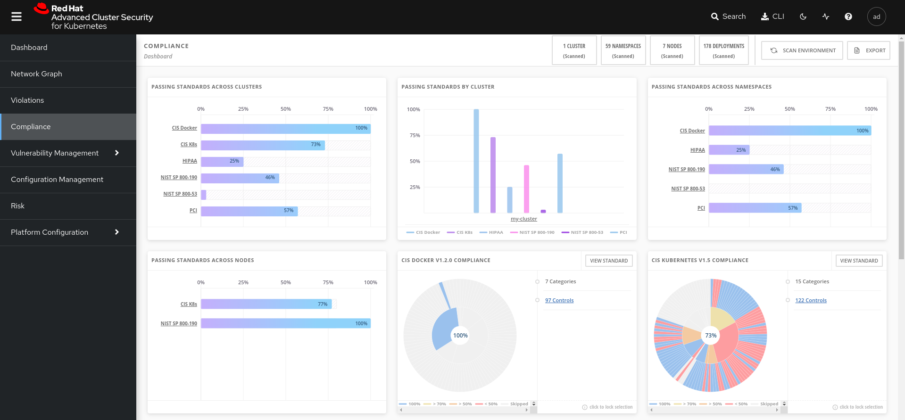

# Compliance

By using Red Hat Advanced Cluster Security for Kubernetes you can assess, check, and report on the compliance status of your containerized infrastructure. You can run out-of-the-box compliance scans based on industry standards including:

- CIS Benchmarks (Center for Internet Security) for Docker and Kubernetes
- HIPAA (Health Insurance Portability and Accountability Act)
- NIST Special Publication 800-190 and 800-53 (National Institute of Standards and Technology)
- PCI DSS (Payment Card Industry Data Security Standard)

By scanning your environment based on these standards you can:

- Evaluate your infrastructure for regulatory compliance.
- Harden your Docker Engine and Kubernetes orchestrator.
- Understand and manage the overall security posture of your environment.
- Get a detailed view of compliance status for clusters, namespaces, and nodes.

## Running a Scan

Running a compliance scan checks the compliance status for your entire infrastructure across all compliance standards. When you run a compliance scan, Red Hat Advanced Cluster Security for Kubernetes takes a data snapshot of your environment. The data snapshot includes alerts, images, network policies, deployments, and related host-based data. Central collects the host-based data from the Sensors running in your clusters. 

The procedure to execute the compliance scan:

- Go to the RHACS portal -> Compliance -> Scan environment

After a few minutes, it is possible to review the compliance dashboard.

## Industry Standards Overview

### CIS Docker

The Docker CIS Benchmark focuses on ensuring Docker containers runtimes are configured as securely as possible.

The following examples are included in this category:

- Host General Configuration (Runtime up to date, container host hardened, etc)
- Linux Host Specific Configuration (Separate partition for containers, container engine daemon securization, engine daemon configuration files and directories, etc)
- Container Images and Build (Trusted base images, setuid & setguid permissions removed, review COPY instead of ADD is used, ensure secrets are not stores in Dockerfiles, etc)
- Container Runtime (CPU priority is set, host's network namespace is not share, mount propagation is not active, cgroup usage is confirmed, etc)

### CIS k8

The CIS Kubernetes Benchmark is a set of recommendations for configuring Kubernetes to support a strong security posture.

The following examples are included in this category:

- Default namespace is not set
- Apply Security Context to Pods and Containers
- Consider external secret storage
- Ensure that the API server pod specification file permissions are set to 644 or more restrictive
- Ensure that the etcd pod specification file ownership is set to root:root
- Ensure that the proxy kubeconfig file permissions are set to 644 or more restrictive

NOTE: For more information visit the following [link](https://cloud.google.com/kubernetes-engine/docs/concepts/cis-benchmarks)

### HIPAA

The Health Insurance Portability and Accountability Act of 1996 (HIPAA) is a federal law that required the creation of national standards to protect sensitive patient health information from being disclosed without the patient's consent or knowledge.

The following examples are included in this category:

- Security Management Process
- Information Access Management
- Identify and respond to suspected or known security incidents
- Implement procedures to determine that the access of a workforce member to electronic protected health information is appropriate.

### NIST SP 800-190

NIST SP 800-190 explains the security concerns associated with container technologies and recommendations for the image details and container runtime security. It provides prescriptive details for various sections including image, registry, orchestrator, container and host OS countermeasures.

The following examples are included in this category:

- Image Vulnerabilities
- Image configuration defects
- Insecure connections to registries
- Stale images in registries
- Unbounded network access from containers

### NIST SP 800-53

NIST Special Publication 800-53 provides a catalog of security and privacy controls for all U.S. federal information systems except those related to national security. It is published by the National Institute of Standards and Technology, which is a non-regulatory agency of the United States Department of Commerce.

The following examples are included in this category:

- Role-Based Access Control
- Permitted Actions Without Identification Or Authentication
- Internal System Connections
- Access Restrictions For Change
- Automatic Disabling Of Information System

### PCI DSS

The Payment Card Industry Data Security Standard is an information security standard for organizations that handle branded credit cards from the major card schemes. The PCI Standard is mandated by the card brands but administered by the Payment Card Industry Security Standards Council.

The following examples are included in this category:

- Current network diagram that identifies all connections between the cardholder data environment and other networks, including any wireless networks
- Limit inbound Internet traffic to IP addresses within the DMZ.
- Remove all unnecessary functionality, such as scripts, drivers, features, subsystems, file systems, and unnecessary web servers.
- Maintain an inventory of system components that are in scope for PCI DSS.
- Ensure that all system components and software are protected from known vulnerabilities by installing applicable vendor-supplied security patches.

## Author

Asier Cidon (@RedHat)